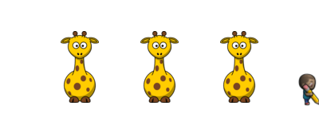

Task: 

1. [Visit this sandbox stage 3.15](https://studio.code.org/s/course3/stage/3/puzzle/15)
2. Use some of the available blocks to make a drawing as close as possible to the following image:

3. (Bonus) Ensure the whole image fits on screen, as pictured.

4. (Bonus) Use as few blocks as possible
