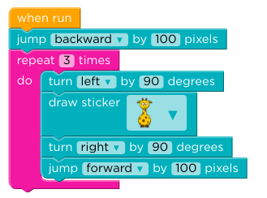

# Time 1 - 10 minutes

# What's being assessed here?

This task is an opportunity to assess some/all of the following:

* Pattern recognition: Student recognises they have repeated code
* Choosing the right tool: Student knows a loop should be useful when they have repeated code.
* Correct application of a loop: Student does *something* three times, even if the images aren't oriented correctly.
* Some code should be outside of the loop: Student recognises some code must be outside loop to happen only once (in this case, reverse once before starting diagram)
* Playing computer: Student thinks through the sequence of necessary steps (It may be that the student just plays with the block order until they land on the right solution, this is ok).
* Exploration: how does the student deal with not being handed *everything*?  The perfect solution requires a block called jump that they won't have used much before.  Do they look for it?  Are they helpless?
* Attention to detail: student looks for, finds detail differences between the target image and her own result.
* Communication during task: (this may depend on whether it's truly a pairing task or whether we're just observing the student do the task.)

# TODO: Presenting yourself and the task

(Are we asking to observe the student and their thought process during this task, or are we truly pairing?  What will be our contribution A) in the case the student can clearly do it all themselves?  B) in the case the student is lost?)

# TODO: rubric

add a rubric based on the above

# Suggested hints:

* "Great!  Do you think you can do this in a way that uses fewer blocks?"

* "It looks like you're doing almost the same thing over and over..."

* Is anything different between your result image and the target image?

* [In case they don't know how to 'jump'] "Do you know what all these available blocks do?  How could you find out?"

# Further challenges

* *"Right first time"*  If when asked the student thinks the task will be easy, challenge them to do get it right first time (or right in two).  Tell them they're permitted just one (or two) presses of the "Run" button.  Model and encourage "playing computer" if that practice is new to them.

TODO: Add further small challenges /variations for students for whom this is far, far too easy, so that we still learn something from the assessment task.

# Example solution(s)

# Potential issues:

This is a blank slate exercise, so some students may be overwhelmed and unable to make a start.  In this case the mentor should stress that this is normal in the job, and should encourage play and iterative progress towards the target result ("Can we get one animal drawn?  "Great!  What's different about that one and the ones in the target image?"  "Can we get it standing up?"  "How about two now?)
