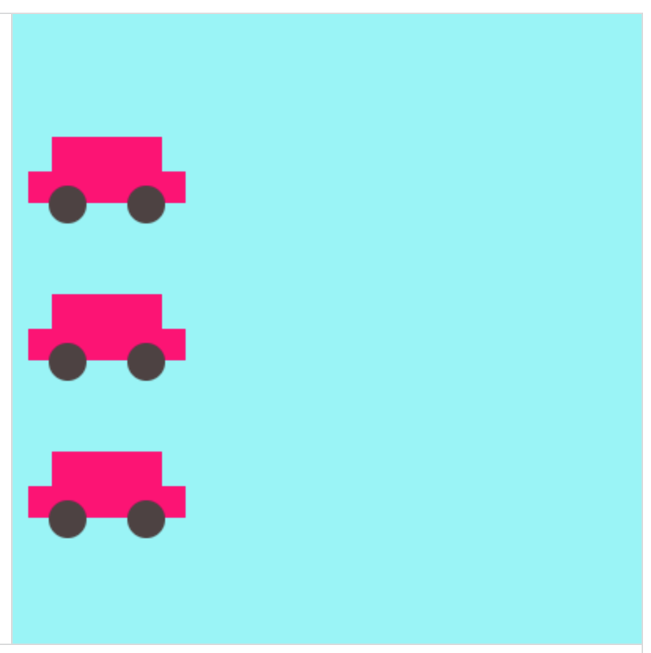
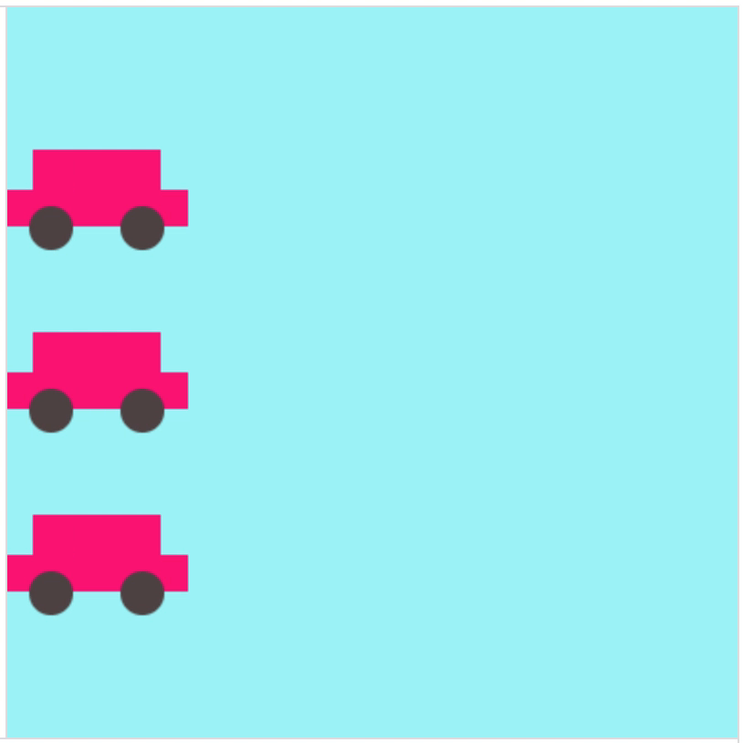

### Task

1. [Open this sandbox coding environment](https://www.khanacademy.org/computer-programming/cyf-intro-to-programming-step-0/5809430823665664)
2. Take some time to read the code and understand it
3. Can you explain what line 16 does?
4. Modify the existing code to make a drawing as close as possible to the following image: 
5. (Optional) Try to use as few lines of code as possible

#### Advanced Task 1

Modify the exercise so that the cars animate like in the following animation:  (**NOTE** the animation loops back to the beginning, but your code doesn't need to do that)

#### Advanced Task 2

Modify the exercise so that the cars "bounce" when they reach the edge like in the following animation: 
